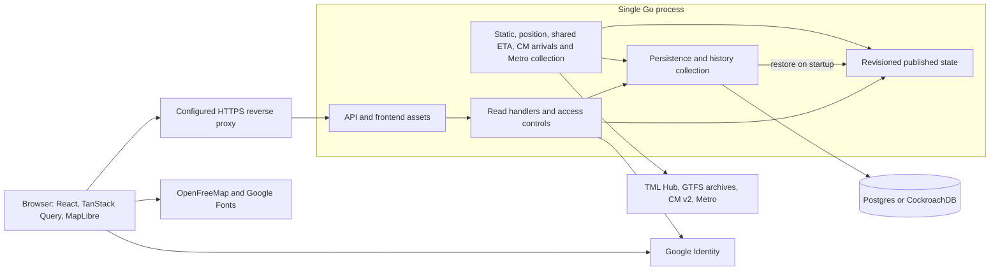
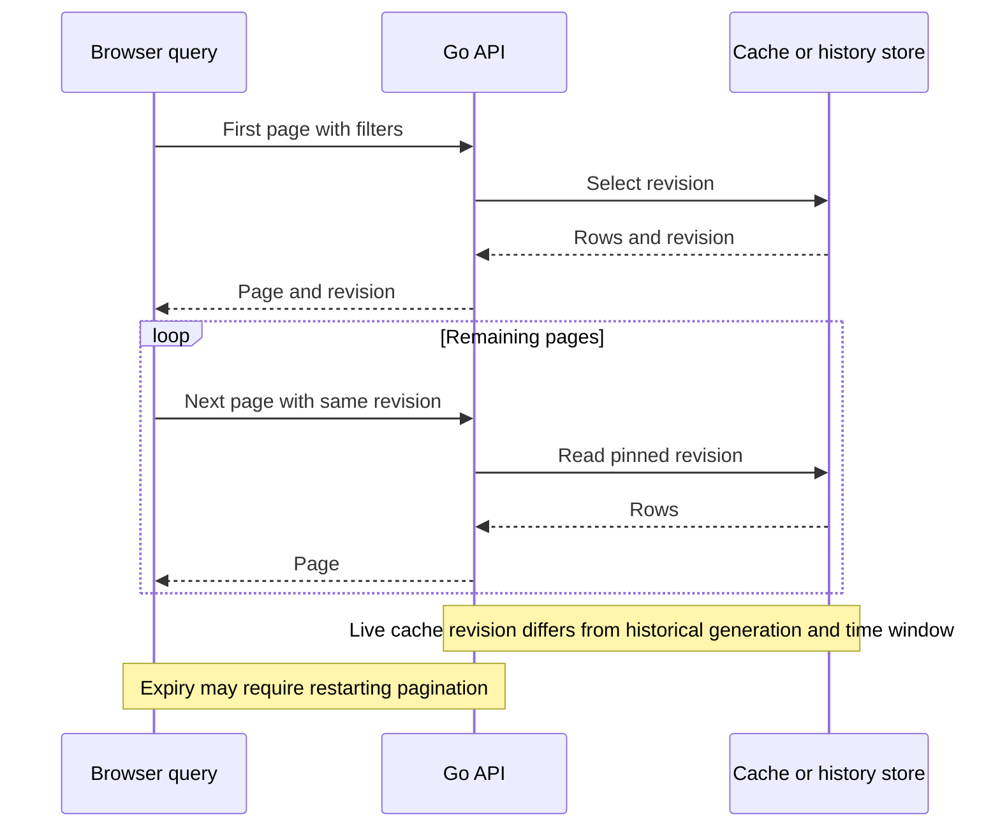

# Application architecture

Lisboa Pública runs as one Go process that serves the generated HTTP API and the built React frontend. Collection, normalization, cache publication and historical persistence are responsibilities within that process. Postgres or CockroachDB stores durable state. Production selects PostgreSQL 17 in the dashboard’s Compose project with a persistent volume and an internal network; Cockroach Cloud remains an optional external configuration. There are no independently deployed services per operator.

## Runtime boundaries

The proxy represents the configured production deployment; local development can access Go directly. Vite can serve the frontend during development. Google verification and browser resources are outside the transport-provider HTTP budget. Diagram arrows describe dependencies, not a universal database-and-memory transaction.

## Startup and shutdown

[The entry point](../cmd/server/main.go) requires `DATABASE_URL`, opens the store, initializes the schema, applies [history settings](../cmd/server/config.go), creates a cache and restores persisted state. Configuration, initialization or restoration errors stop startup. The API validates origin/environment configuration and constructs its generated handler before serving requests.

One shared `http.Client` has a 45-second timeout and a `BudgetTransport` capped at 900 provider attempts per rolling minute. General ingestion starts when `INGEST_ENABLED=true` (the default). The direct Metro loop starts when both Metro credentials exist, independently of `INGEST_ENABLED`. CP predictions wait for static CP data; additional TML arrivals require a requested stop with eligible static data. A cold start can show loading/unavailable data until collection succeeds.

SIGINT/SIGTERM cancels the shared context and initiates HTTP shutdown with a ten-second timeout. The entry point does not explicitly join every collector or perform a final flush of unfinished history buckets. Restart can lose transient predictions, unpublished writes and unfinished aggregates.

## Collection and normalization

| Path | Cadence and prerequisites | Result |
|---|---|---|
| Static | Initial collection, then five-minute loop; reusable successful static cache lasts six hours | Active Hub plan discovery, bounded normalized GTFS parsing, CM catalogue/geometry and fleet metadata |
| Positions | Initial collection, then nominal five-second loop | Hub positions for seven operators, direct CM positions, observation admission and continuity |
| Shared ETA | Nominal five-second loop when CP static data or additional-stop demand exists; serialized five-second attempt | CP predictions plus demanded TML stop arrivals from one decode |
| CM arrivals | Separate nominal five-second loop; bounded requested-stop demand | Ephemeral direct arrivals independent of CP latency |
| Direct Metro | Initial collection, then dedicated 500 ms minimum start interval with credentials; serialized with no overlap/catch-up | OAuth token reuse, line status, waits and station metadata |
| Cleanup/archival | Five-minute ticker in the position loop | Bounded retention cleanup and optional PostgreSQL payload archival |

These are local schedules, not guarantees of exact completion intervals or new source observations. Filters in the UI affect enabled queries and returned entities, not which operators the position/static collectors ingest. Stop arrival reads additionally register bounded30-second demand; they never perform an upstream fetch in the HTTP reader.

[Request policy](../internal/app/upstream.go) caps actual attempts, including OAuth and followed redirects. In addition to the shared 900/minute ceiling, TML uses a local 120/minute cap and CM uses 40/second. These are implementation policies, not assertions of current provider quotas. Network failures and HTTP 429/503 introduce source cooldowns; a valid `Retry-After` is respected. Attempts rejected by a budget wait for a later scheduled refresh. Redirects retain HTTPS hostname and effective port and have a bounded chain.

Parsers validate identity, time, coordinates and bounded payloads. [Source references](integrations/README.md) explain raw inputs; [associations](data/associations.md) explain crosswalks and matching. No Mover Lisboa API is consumed.

## Publication, persistence and recovery

| Data path | Memory publication | Durability |
|---|---|---|
| Static data and metadata | Replace the static state after a successful save | Compressed, chunked static cache and source health |
| Permanent vehicle facts | Independently stage explicitly supplied fields; enrich admitted positions | Separate `vehicle_facts` table, no automatic TTL; pending changes retry in cache/health/history transactions |
| Vehicle positions | Advance in-memory state independently of successful writes | Live cache/health and selected history; normally at most once per 30 seconds in aggregate mode, each update in raw mode |
| Requested-stop arrivals | Publish only against the exact static generation used; independent bounded store | None; no ETA rows in64 archived network revisions |
| CP predictions | Publish only if the static state used for normalization is still current | Memory only; a static CP update invalidates predictions |
| Direct Metro | Advance in-memory direct state independently of successful writes | Separate `cache_parts` kind `direct`, with writes limited separately to 30-second cadence |

The store's `PublishMu` coordinates collector publication; cache updates publish new states under a cache lock. Published display revisions do not carry pending history samples, and archived revisions do not retain the full continuity replay ledger.

[Store initialization and restoration](../internal/app/store.go) restore static/live data and source health; direct Metro has its own restored cache. Restored positions are marked unverified and continuity is broken, preserving original clocks instead of inventing a movement pair. CP waits for recollection. Metro Hub model-position availability is process-local state (`model_position_state`, `last_model_position_at`): a restored operator row is reset to `unknown` until the new process evaluates a healthy Hub batch, so a previous process's `publishing` or `unavailable` cannot be served after a restart. Detailed retained facts and history failure semantics are in [History and derivation](data/history.md).

## Read consistency and frontend queries

[Live cache revisions](../internal/app/data.go) expire by age (five minutes) and capacity (64 versions); validity for the entire five minutes is not guaranteed. [Vehicle revisions](../internal/app/vehicle_revision.go) also freeze the clock used to project freshness. [Historical revisions](../internal/app/history.go) freeze a SQL generation and time window. CP reads preserve a coherent prediction/schedule view. These mechanisms do not create one transaction covering all dashboard queries.

[The frontend pagination helper](../frontend/src/data.ts) carries the returned revision through subsequent pages and restarts on HTTP 410, up to three attempts. [CP queries](../frontend/src/cp.ts) have their own coherent collection logic. TanStack Query uses the [generated client](../frontend/src/api.ts), same-origin credentials and query keys incorporating selections. Live queries generally refresh at the reported live interval; historical windows advance on a 30-second cadence. CP, Metro and ordinary live API reads consume published cache. Additional stop arrival reads register demand for the asynchronous collectors; popup cancellation does not cancel shared collection.

Permanent vehicle attributes use an independent `vehicle_facts` table keyed by exact operator/source identity, with registration contexts and field-level provenance. Pending changes participate in the same guarded transaction as cache/health/history writes and are acknowledged only on success. Failed reads retain pending supplied fields until their durable base can be loaded, and failed writes retry without renewing field confirmation times. Legacy caches seed low-precedence facts with explicitly unknown original field provenance; normal guarded writes persist this recovery before replacing the cached source data. Restore lazily reads facts for needed identities independently of `cache_parts` and snapshots. No historical cleanup removes permanent facts. The registry is separate from archived network revisions; it evicts clean memory entries while preserving dirty changes. Position display retention is ten minutes from the original source clock and does not renew on polling or restore. Last-known display inventory follows that window; the old 500-position cap no longer applies. Existing response-size and guarded write limits remain in force. Under the former 24-hour display policy, a dated [fixed-fleet resource measurement](research/vehicle-position-retention-2026-09-27/resource.txt) retained 80,000 synthetic identities with all eight official static fixtures and 64 revisions on macOS: heap was about 1.63 GB and runtime system allocation about 2.65 GB. This does not certify the former one-GB Linux envelope or a production inventory bound; the older capped-display measurements must not be applied to this retention policy.

## API, authentication and trust

[OpenAPI](../api/openapi.yaml) generates the strict Go interface and TypeScript client through the [generation workflow](../scripts/generate.sh). [The server](../internal/app/server.go) applies request validation, identity/scopes, per-IP/principal rate limits and generated dispatch. Heavy reads are bounded to two concurrent operations with 15-second contexts and result limits. The frontend distinguishes `busy` responses and uses bounded retry/backoff. Metro patterns station and onward queries inherit this policy rather than waiting only for their 30-second polling interval after transient admission failures.

Reads are public by default. `PUBLIC_READS=false` requires credentials for operations marked public reads. Supplied API keys are still checked for expiry, revocation and scopes on public reads. Key management requires a browser session. [Google sign-in](integrations/google-identity.md) verifies ID tokens and binds login to origin/nonce, then creates an HttpOnly session. Session/key secrets are stored as hashes. `DEV_AUTH` requires a development environment; its login endpoint additionally requires a loopback peer and origin/nonce binding. Production refuses it.

Metro secrets stay in the server environment. `PUBLIC_ORIGIN` establishes the allowed browser origin. [Proxy trust](../internal/app/proxy.go) accepts the client-IP header only from configured peers; [deployment instructions](../deploy/README.md) require Caddy to overwrite it. Exact operational settings belong in that guide.

## Failure and recovery

| Condition | Application behavior |
|---|---|
| Upstream failure/throttling | Mark source error, preserve prior usable data and original observation clocks, retry on scheduled refresh after applicable cooldown |
| Successful empty positions | Known successful source coverage with no new membership; omitted vehicles immediately become `not_reporting/missing_from_snapshot` and remain visible until the ten-minute source-clock deadline, with a separate age warning after five minutes |
| Source not recently verified | Current counts can become unknown; age and last-known projection do not turn old reports into fresh observations |
| Missing Metro credentials | Direct status is unconfigured; estimated Hub positions and planned GTFS remain distinct paths |
| Static/geometry failure | Preserve eligible prior data; geometry availability may differ from schedule availability; fallback is source-specific |
| Database write failure/storage pause | Live memory can continue while durability/history lags or has gaps; collection status explains the interruption |
| Expired revision | HTTP 410; callers restart pagination |
| Clean database cutover | Initialize an empty schema and recollect static/live feeds; previous database history, sessions and API keys are absent; separate filesystem archives remain independent |
| Restart/shutdown | Restore durable state with original clocks; CP is transient; unfinished history and changes since successful writes may be lost |

## Runtime configuration

These defaults come from [main.go](../cmd/server/main.go), [config.go](../cmd/server/config.go) and [limits](../internal/app/limits.go); production overrides are documented in [deployment](../deploy/README.md).

| Setting | Code default or requirement | Role |
|---|---|---|
| `DATABASE_URL` | Required | Postgres/CockroachDB connection |
| `PUBLIC_ORIGIN` | `http://localhost:8080` | Browser origin and auth binding |
| `ENVIRONMENT` | `development` at the entry point | Production origin/development-login restrictions |
| `LISTEN_ADDR` | `127.0.0.1:8080` | HTTP listener |
| `FRONTEND_DIR` | `frontend/dist` | Built frontend location |
| `INGEST_ENABLED` | `true` | General static/position/CP collection |
| `PUBLIC_READS` | `true` | Anonymous access to marked reads |
| `LOG_LEVEL` | `info` | Zap level; `debug` enables the bounded Metro sample/own-forecast counters |
| `DEV_AUTH` | `false` | Restricted local development login |
| `GOOGLE_CLIENT_ID` | Unconfigured | Optional Google sign-in |
| `METRO_CLIENT_ID`, `METRO_CLIENT_SECRET` | Unconfigured | Separate direct Metro collection |
| `RATE_LIMIT_PER_MINUTE` | 300 | Incoming per-IP/principal limit |
| `TRUSTED_PROXY_CIDRS` | Empty | Peers trusted to supply the overwritten client-IP header |
| `SNAPSHOT_RETENTION_DAYS` | 30; accepts 1–30 | Public history window |
| `HISTORY_INTERVAL_SECONDS` | 0; accepts 0 or 300 | Raw versus aggregate collection |
| `STORAGE_GUARD` | `false` | Guarded startup/writes; enabled in production |

## Code navigation and evidence

| Responsibility | Entry points and behavior evidence |
|---|---|
| Startup/settings | [main.go](../cmd/server/main.go), [config.go](../cmd/server/config.go) |
| Collection/policy | [ingest.go](../internal/app/ingest.go), [upstream.go](../internal/app/upstream.go), [policy tests](../internal/app/upstream_policy_test.go) |
| Publication/continuity | [data.go](../internal/app/data.go), [live_publication.go](../internal/app/live_publication.go), [continuity tests](../internal/app/continuity_test.go) |
| Persistence/history | [store.go](../internal/app/store.go), [snapshots_store.go](../internal/app/snapshots_store.go), [storage budget](../internal/app/storage_budget.go) |
| CP/Metro | [CP collection](../internal/app/cp_collect.go), [CP read tests](../internal/app/cp_reads_test.go), [metro.go](../internal/app/metro.go) |
| Auth/HTTP | [auth.go](../internal/app/auth.go), [middleware](../internal/app/http_middleware.go), [security tests](../internal/app/security_fixes_test.go) |
| Frontend | [App.tsx](../frontend/src/App.tsx), [main.tsx](../frontend/src/main.tsx), [data.ts](../frontend/src/data.ts) |

## Arrival result leases

[Arrival reads](../internal/app/arrivals_reads.go) default to a one-hour interval. An `a:` revision pins the first page's normalized result, selector and bounds with a random process epoch and bounded retention; expiry, eviction, restart or static-generation replacement returns410. Selector changes return400. Source clocks and validity survive pagination. Pure GTFS pages and existing CP/Metro paths retain their previous revision behavior.

[Retention](../internal/app/arrivals_store.go) is independent of the64 network revisions:32 demand keys per source,3MiB TML/1MiB CM normalized retention,1MiB results and at most64 leases. No neighbour prefetch is added; complete popup schedules now use a separate lazy index tied to each immutable static generation. [Measured resource validation](VALIDATION-stop-arrivals.md) preserves the original full-network workload and limits. These application limits are separate from upstream provider guarantees and container settings.

## Frozen vehicle navigation and selective paths

`GET /api/v1/vehicles/{vehicle_id}/calls` reads existing immutable cache revisions under the same admission, scope and rate limits as other heavy reads. Response-only vehicle references bind operator, observation, source service, operating date and optional published pattern identity; they are not credentials. Pagination freezes the result, and CP predictions expire at the earliest source expiry. A missing or evicted reference fails closed.

CM paths share one validated stop sequence per published pattern and reference existing geometry, rather than retaining an index per trip. Paths and shapes publish/restore/retain atomically in the static cache. Legacy CM caches lacking a recorded path attempt use the normal scheduled refresh once before the reuse TTL; completed empty or rejected attempts retain normal reuse behavior after restart. The selected vehicle popup requests 20 calls per page; optional exact geometry is returned only on page zero. Later-page overlay reactivation requests page zero with the same frozen reference/revision. Closing, switching, or disabling the overlay cancels the browser fetch and clears the highlight. Heartbeats do not reposition the map or resend identical geometry. No provider request is made by the calls endpoint. Ordinary station arrival reads retain their existing bounded asynchronous demand registration.

## Direction boards and complete journey times

[Direction boards and journeys](VEHICLE-POPUPS.md) add cached reads alongside the existing calls/navigation operations. GTFS schedules retain full visits separately from local map visits and build an immutable lazy trip/stop/direction index once per static generation. TML ETA decoding is shared between CP, bounded per-operator publications and requested-stop arrival collection; the native CM collector keeps its existing demand and request budgets. A board `b|` revision combines the frozen network with an existing bounded arrival-result lease. Journey `j:` revisions pin network/observation, read time and committed stop-event generation. Actual events are served only after persistence; no current upstream adapter produces certified occurrences.

For operators other than Metro, the [station board controller](../frontend/src/useStationBoard.ts) publishes one complete board/selected-page frame after both requests succeed. Sliding query-window revisions may change on every poll; this does not clear the displayed frame. Refresh is serialized with the next attempt five seconds after completion. HTTP 410 retries the board/page sequence once, retaining selection. A vanished results page is replaced by the nearest valid page in the same direction and revision before frame publication. Selection epochs and abort signals reject obsolete responses, and errors retain the previous frame with original expiry. [Reading restoration](../frontend/src/useStationReading.ts) runs before paint using surviving row identity/viewport position and focused controls. Local expiry applies independently of request success. This does not create a transaction across unrelated dashboard queries or persist browser frames.

[Station coverage](../internal/app/popup_station_coverage.go) is derived after source rows are assembled: the board considers all directions and a calls page considers its returned rows. Valid forecasts from one source survive another source's unavailable status; planned fallback remains partial, and stale static networks remain marked stale. No new source requests, persistence or forecast validity are introduced. [Station identity](../frontend/src/stationIdentity.ts) groups only complete same-operator parent relationships for presentation; nearby candidates reconcile selected operators and current catalogues rather than a captured operator list.

The complete timed journey appears only with a safe plan/route/trip/date association. The existing CM published-pattern path and next-stop fallback remain separately available when a timed journey cannot be identified. UI polling does not change the provenance, observation clock or highlighted path.

The compatibility journey endpoint can expose a Metro published route with an explicitly separate association, null journey identity and unavailable individual stop times. Matching uses the existing immutable static index plus the captured route/trip or a fresh direct destination; it neither fetches upstream data nor reads stop events. It reuses the frozen journey revision and read-result limits. The route-only projection is response data, not a new durable vehicle state, observation or retained historical journey.

The popup schedule retains a single visit sequence when the local and complete journeys coincide.
Cache restoration streams individual trips and interns stop identities,
so decoding does not buffer the whole expanded timetable.
The station-to-trip lookup is lazy and bounded to 32 selected stops and 4 MiB per immutable network revision;
a cache miss scans the retained local visits without dropping calls.

The route/direction catalog and CM route/plan/agency source metadata are shared across trips.
Trip identity lookups scan the immutable schedule without retaining a second trip-ID map.
Road-operator visit deltas are losslessly compressed before geometry ingestion,
and exact GTFS stop-to-line membership narrows station reads before decompression.

## Durable reporting state

[Reporting classification](../internal/app/vehicle_reporting.go) maintains a separate latest `vehicle_reporting` row keyed by exact operator/source identity, including inferred Metro identities. It stores state/reason clocks, latest accepted observation and successful membership clocks, and internal collection/membership evidence. It does not store transition history. The table survives position expiry and snapshot cleanup; it is not a full registered vehicle inventory.

Reporting changes participate in the existing guarded cache/health/history transaction and conservative operational byte reservations. State/reason transitions request immediate persistence; unchanged membership/observation clock updates use the existing 30-second batch cadence. Only committed matching versions are acknowledged. Failed writes preserve dirty versions and expose `persisted=false`; monotonic row versions and original observation checks reject regressions, including after map expiry. Restoration preserves clocks and classifies restored sources as unverified until collection succeeds. No migration backfills a supposed reporting history.

An independent [reporting worker](../internal/app/vehicle_reporting_worker.go) runs even when `INGEST_ENABLED=false`, checking cached identities every second without browser reads. It reconciles database-only identities in primary-key batches of at most 128 rows every 30 seconds; those expired identities converge over multiple batches, rather than receiving the visible inventory's immediate transition guarantee. Stable reconciliations do not write SQL. Operations use a five-second context. Exact identity loads are lazy; the registry bounds cached identities at 8,192, evicts clean entries and protects pending changes. Capacity failures are logged instead of allowing unbounded growth. Database admission/availability can delay persistence, and source polling determines when omission can first be known.

The API exposes latest reporting state on retained vehicles. The browser displays reporting independently of physical stop status and adds a marker warning immediately for `not_reporting`, retaining its independent five-minute age warning and ten-minute offline display expiry. A source error is `unknown`, not an omission. See the [state evaluation table](data/README.md#backend-owned-reporting-state).

## Metro pattern archive and recovery

The existing direct Metro collector also feeds the independent `internal/patterns` service. It samples detail at its configured cadence and checks known intermediate continuity losses at the existing refresh rate. The service never calls providers or writes the operational database. A failed archive write revokes live historical support and reports a paused/gap state without suppressing official live publication.

One process owns the archive through an OS file lock. Queries, immutable generation publication, checkpointing and FIFO share a bounded serialized file-reading phase; readers close before deletion. Files are fsynced and renamed before an atomic fsynced manifest admits them. Full codec roundtrips and checksums precede admission. Startup reconciles managed orphan generations, rejects an invalid manifest without overwriting it and restores verified checkpoints. A retained verified hour can replay chronological receipts after the checkpoint using its stored topology. Restart always reinitializes association continuity; unavailable/corrupt/retired data never become zero coverage or restored training.

The manifest and state live on the same persistent server volume as detail and aggregates. This avoids increasing the operational database budget and requires one collector. Replacement generations, temporary files, metadata, directories and state count towards allocated archive bytes. Expiration precedes global oldest-data FIFO. New readers cannot retain deleted bytes outside the lock. Hot training state, detail buffers, row counts and query output/duration are independently bounded. See [model](metro-patterns.md), [history](data/history.md) and [configuration](../deploy/README.md).

The local completion follow-up adds route-specific conditions, versioned Lisbon holiday grouping, labeled older/general-context component fallback, unchanged-segment compatibility, conservative mixed-bin calibration and durable bounded MAE/P90/availability/band-support reports. Evidence-backed maintenance revises retained inputs atomically while keeping issued values. Staged normalized observation/prediction capture and experimental own-forecast adapters cover all eight existing operators under the same archive budget. Metro uses ETA transitions; later stages require verified published paths and coherent reported stop-state transitions. Forecast availability depends on actual compatible inputs, and physical validation remains unavailable. See [current behavior](metro-patterns.md) and [remaining live evidence](GAPS-metro-patterns.md).

Other-operator transport archive writes use one bounded eight-receipt queue/worker outside live publication. Overflow/write failure marks a later retained collection-gap receipt, including between normal sampling instants. Cancelling collection can leave queued receipts unwritten; timestamps are not renewed and restart does not prove continuity. Metro's direct wait inference continues to use its existing sampled/intermediate path.

The queue assigns an archive receipt clock while holding its enqueue lock, retaining
the original snapshot collection clock separately. Independent collectors may
finish out of order; source observation/prediction clocks and validity are never
renewed. Per-identity intermediate cuts are retained separately from operator-wide
collection gaps, preserving unrelated associations during replay. Later-stage
recovery treats complete newest daily generations as authoritative, suppresses
already published contributions and replays retained post-checkpoint inputs across
closed hours. Degraded recovery also resets all live continuity. A checkpoint whose
marshaled payload would exceed the single-block archive limit trims the oldest
aggregate days from the in-memory window (never the current day, a dirty day or a day
with a live association), discloses the reduced window and, when no day can be
trimmed, fails the flush explicitly instead of emptying the engine or pausing
silently; published daily files are untouched. Maintenance can
revise later-stage normalized observations with the same exclusive transaction
and bounded replay/publication policy; original forecasts remain immutable.

Patterns reads expose fresh official values from the existing accepted cache even when the experimental archive is disabled or unreadable. This response-only fallback preserves source clocks/expiry and does not enter historical calibration or evaluation; read failures suppress own points. See [official-cache behavior](metro-patterns.md#published-stop-adapters-for-later-stages).

## Metro scoped live delivery

[Metro live popups](metro-live-popups.md) use one complete scoped projection for map, selected journey or
station inventory, served through SSE and conditional JSON. The collector processes original updates before
frame coalescing; the browser accepts complete ordered frames, pins journey identity and preserves direction,
reading/focus and manual camera pause. Browser reads never start additional Metro collectors.
Finite frame construction uses read admission; stream lifetime does not occupy a read slot. Per-write deadlines,
bounded queues/frame bytes/admission, auth expiry/revalidation and full-reset recovery are separate from normal
JSON deadlines. [Implementation](../internal/app/metro_live.go) and [tests](../internal/app/metro_live_test.go)
define these boundaries. The shared classified-context runtime owns admission and vehicle matching; raw destination matching is not rerun by frames. Frames read one runtime snapshot, including journal acknowledgements, rather than waiting for another source collection. Complete latest journey checkpoints share the archive owner/budget and restore event-free histories without live continuity. Fresh supported journeys are selectable in memory before archive acknowledgement; pending/unavailable persistence is explicit. Legacy event proofs remain an explicitly partial fallback. Missing pins return explicit recovery state without dangling selected identities. The existing 64-version cache remains a separate pagination boundary;
complete live frames do not paginate through or promise five-minute retention in that cache.

`METRO_REFRESH_MILLISECONDS` defaults to 500, accepts 500–60000, and does not change `live_refresh_seconds`
for other feeds. One shared collector/transport must own the subscribed quota; independent external consumers
are not automatically coordinated. The one-second healthy-SSE P95 objective requires dated validation evidence.

Hub positions acquisition has a separate one-second minimum-start target in [its scheduler](../internal/app/hub_positions.go). Only Metro positions publish at that cadence; the existing five-second general consumer reuses the latest complete Hub response. ETA/static and other operator schedules remain separate. Positions protect 20 Hub/100 global attempt slots and bounded active protected chains under the hard shared caps; sustained pressure changes the target to two/five seconds and cooldowns win. Each recovery step requires a healthy rolling minute. No browser operation adds source requests.

Initial SSE reset projection waits at most one second for the existing two-slot expensive-read admission. The existing process/IP/principal stream limits bound waiters, and cancellation releases admission. Sustained pressure still returns HTTP 503; ordinary snapshots remain fail-fast and established SSE ticks coalesce temporary busy projections. This avoids converting brief scope/pin initialization contention into a five-second fallback cycle without increasing concurrency.

Metro lifecycle changes publish a complete in-memory transition immediately. Closure and successor activation reserve and enqueue one complete checkpoint generation; queue/archive failure preserves the live transition with unavailable persistence, and retries cannot commit one half. A terminal return also requires fresh opposite model movement. Historical forecast work runs outside the runtime lock and applies only against matching episode/source/profile fences. The bounded history worker prevents archive I/O from holding source publication. Restart restores suspended history and cuts detector continuity.

### Metro operational service and forecasts

The runtime validates Hub trip, direction, pattern and shape against the same active static artifact, and projects model positions onto published oriented geometry. Three original-clock positions can select an estimated direction; one unique compatible forecast context can also supply a clearly estimated direction. These are ETA-dependent models, not independent physical movement. Opposing contexts are alternatives; incompatible evidence suspends association. One line/reference has at most one current episode.

Direct waits, line state and catalogues have independent lanes. State failures do not postpone waits, and state receipt age/error remain distinct from wait freshness. Missing catalogues retry; successful catalogues refresh daily. Compatible scheduled run/dwell priors supplement official forecasts, while supported historical own arrivals retain precedence. Conditional remaining dwell and inferred departure anchors constrain onward estimates. Anonymous forecasts have separate continuity and candidate sets; hidden trains remain possible and uncertain ownership does not become direction evidence.

Changed normalized inputs and lifecycle checkpoints use the existing bounded archive owner. The optional legacy reviewed model allowlist remains supported; the experimental operational model does not require independent physical calibration to display clearly labeled estimates. Source clocks, model publication, application receipt, frame publication and archive acknowledgement remain separate. See [current Metro behavior](metro-live-popups.md) for admission, bounds and limitations.

Forecast-context computation is reused across scoped readers for at most 500 ms, invalidated on every operational publication and own-forecast update, and cut at the nearest prediction/validity boundary. Returned call/provenance slices are independent copies; reuse neither renews source age nor delays input invalidation.
