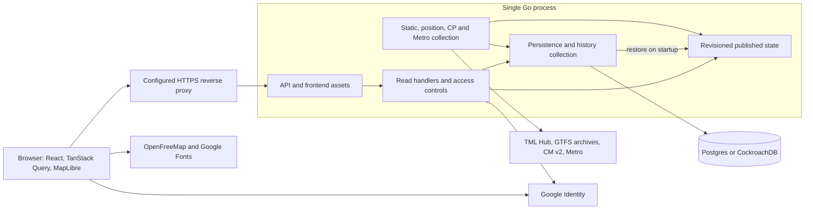
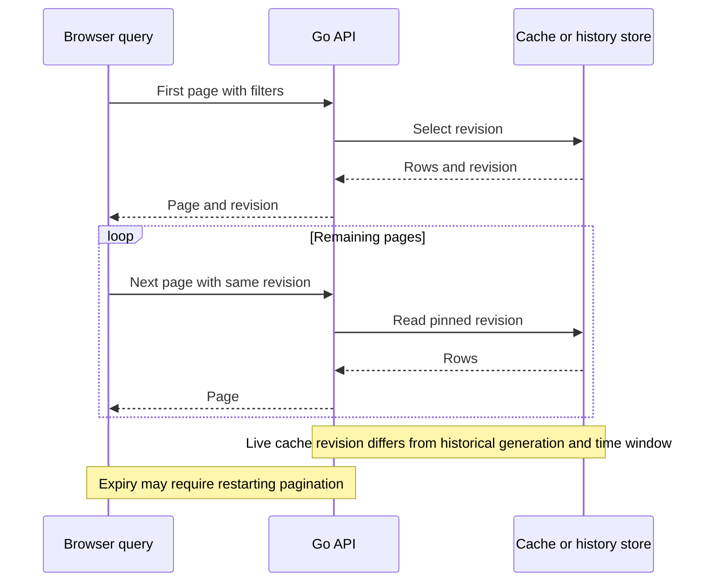

# Application architecture

Lisboa Pública runs as one Go process that serves the generated HTTP API and the built React frontend. Collection, normalization, cache publication and historical persistence are responsibilities within that process. Postgres or CockroachDB stores durable state. There are no independently deployed services per operator.

## Runtime boundaries

The proxy represents the configured production deployment; local development can access Go directly. Vite can serve the frontend during development. Google verification and browser resources are outside the transport-provider HTTP budget. Diagram arrows describe dependencies, not a universal database-and-memory transaction.

## Startup and shutdown

[The entry point](../cmd/server/main.go) requires `DATABASE_URL`, opens the store, initializes the schema, applies [history settings](../cmd/server/config.go), creates a cache and restores persisted state. Configuration, initialization or restoration errors stop startup. The API validates origin/environment configuration and constructs its generated handler before serving requests.

One shared `http.Client` has a 45-second timeout and a `BudgetTransport` capped at 900 provider attempts per rolling minute. General ingestion starts when `INGEST_ENABLED=true` (the default). The direct Metro loop starts when both Metro credentials exist, independently of `INGEST_ENABLED`. CP predictions wait for static CP data. A cold start can show loading/unavailable data until collection succeeds.

SIGINT/SIGTERM cancels the shared context and initiates HTTP shutdown with a ten-second timeout. The entry point does not explicitly join every collector or perform a final flush of unfinished history buckets. Restart can lose transient predictions, unpublished writes and unfinished aggregates.

## Collection and normalization

| Path | Cadence and prerequisites | Result |
|---|---|---|
| Static | Initial collection, then five-minute loop; reusable successful static cache lasts six hours | Active Hub plan discovery, bounded normalized GTFS parsing, CM catalogue/geometry and fleet metadata |
| Positions | Initial collection, then nominal five-second loop | Hub positions for seven operators, direct CM positions, observation admission and continuity |
| CP predictions | Nominal five-second loop, after a CP static plan exists; per-attempt context is five seconds | Validated ephemeral predictions associated with CP schedules |
| Direct Metro | Initial collection, then nominal five-second loop with credentials; refresh serialized and at most once per five seconds | OAuth token reuse, line status, waits and station metadata |
| Cleanup/archival | Five-minute ticker in the position loop | Bounded retention cleanup and optional PostgreSQL payload archival |

These are local schedules, not guarantees of exact completion intervals or new source observations. Filters in the UI affect enabled queries and returned entities, not which operators the collector ingests.

[Request policy](../internal/app/upstream.go) caps actual attempts, including OAuth and followed redirects. In addition to the shared 900/minute ceiling, TML uses a local 120/minute cap and CM uses 40/second. These are implementation policies, not assertions of current provider quotas. Network failures and HTTP 429/503 introduce source cooldowns; a valid `Retry-After` is respected. Attempts rejected by a budget wait for a later scheduled refresh. Redirects retain HTTPS hostname and effective port and have a bounded chain.

Parsers validate identity, time, coordinates and bounded payloads. [Source references](integrations/README.md) explain raw inputs; [associations](data/associations.md) explain crosswalks and matching. No Mover Lisboa API is consumed.

## Publication, persistence and recovery

| Data path | Memory publication | Durability |
|---|---|---|
| Static data and metadata | Replace the static state after a successful save | Compressed, chunked static cache and source health |
| Vehicle positions | Advance in-memory state independently of successful writes | Live cache/health and selected history; normally at most once per 30 seconds in aggregate mode, each update in raw mode |
| CP predictions | Publish only if the static state used for normalization is still current | Memory only; a static CP update invalidates predictions |
| Direct Metro | Advance in-memory direct state independently of successful writes | Separate `cache_parts` kind `direct`, with writes limited separately to 30-second cadence |

The store's `PublishMu` coordinates collector publication; cache updates publish new states under a cache lock. Published display revisions do not carry pending history samples, and archived revisions do not retain the full continuity replay ledger.

[Store initialization and restoration](../internal/app/store.go) restore static/live data and source health; direct Metro has its own restored cache. Restored positions are marked unverified and continuity is broken, preserving original clocks instead of inventing a movement pair. CP waits for recollection. Detailed retained facts and history failure semantics are in [History and derivation](data/history.md).

## Read consistency and frontend queries

[Live cache revisions](../internal/app/data.go) expire by age (five minutes) and capacity (64 versions); validity for the entire five minutes is not guaranteed. [Vehicle revisions](../internal/app/vehicle_revision.go) also freeze the clock used to project freshness. [Historical revisions](../internal/app/history.go) freeze a SQL generation and time window. CP reads preserve a coherent prediction/schedule view. These mechanisms do not create one transaction covering all dashboard queries.

[The frontend pagination helper](../frontend/src/data.ts) carries the returned revision through subsequent pages and restarts on HTTP 410, up to three attempts. [CP queries](../frontend/src/cp.ts) have their own coherent collection logic. TanStack Query uses the [generated client](../frontend/src/api.ts), same-origin credentials and query keys incorporating selections. Live queries generally refresh at the reported live interval; historical windows advance on a 30-second cadence. CP, Metro and ordinary live API reads consume published cache; they do not initiate source collection.

## API, authentication and trust

[OpenAPI](../api/openapi.yaml) generates the strict Go interface and TypeScript client through the [generation workflow](../scripts/generate.sh). [The server](../internal/app/server.go) applies request validation, identity/scopes, per-IP/principal rate limits and generated dispatch. Heavy reads are bounded to two concurrent operations with 15-second contexts and result limits. The frontend distinguishes `busy` responses and uses bounded retry/backoff.

Reads are public by default. `PUBLIC_READS=false` requires credentials for operations marked public reads. Supplied API keys are still checked for expiry, revocation and scopes on public reads. Key management requires a browser session. [Google sign-in](integrations/google-identity.md) verifies ID tokens and binds login to origin/nonce, then creates an HttpOnly session. Session/key secrets are stored as hashes. `DEV_AUTH` requires a development environment; its login endpoint additionally requires a loopback peer and origin/nonce binding. Production refuses it.

Metro secrets stay in the server environment. `PUBLIC_ORIGIN` establishes the allowed browser origin. [Proxy trust](../internal/app/proxy.go) accepts the client-IP header only from configured peers; [deployment instructions](../deploy/README.md) require Caddy to overwrite it. Exact operational settings belong in that guide.

## Failure and recovery

| Condition | Application behavior |
|---|---|
| Upstream failure/throttling | Mark source error, preserve prior usable data and original observation clocks, retry on scheduled refresh after applicable cooldown |
| Successful empty positions | Known successful source coverage with no new membership; omitted vehicles may remain separately labelled last-known |
| Source not recently verified | Current counts can become unknown; age and last-known projection do not turn old reports into fresh observations |
| Missing Metro credentials | Direct status is unconfigured; estimated Hub positions and planned GTFS remain distinct paths |
| Static/geometry failure | Preserve eligible prior data; geometry availability may differ from schedule availability; fallback is source-specific |
| Database write failure/storage pause | Live memory can continue while durability/history lags or has gaps; collection status explains the interruption |
| Expired revision | HTTP 410; callers restart pagination |
| Restart/shutdown | Restore durable state with original clocks; CP is transient; unfinished history and changes since successful writes may be lost |

## Runtime configuration

These defaults come from [main.go](../cmd/server/main.go), [config.go](../cmd/server/config.go) and [limits](../internal/app/limits.go); production overrides are documented in [deployment](../deploy/README.md).

| Setting | Code default or requirement | Role |
|---|---|---|
| `DATABASE_URL` | Required | Postgres/CockroachDB connection |
| `PUBLIC_ORIGIN` | `http://localhost:8080` | Browser origin and auth binding |
| `ENVIRONMENT` | `development` at the entry point | Production origin/development-login restrictions |
| `LISTEN_ADDR` | `127.0.0.1:8080` | HTTP listener |
| `FRONTEND_DIR` | `frontend/dist` | Built frontend location |
| `INGEST_ENABLED` | `true` | General static/position/CP collection |
| `PUBLIC_READS` | `true` | Anonymous access to marked reads |
| `DEV_AUTH` | `false` | Restricted local development login |
| `GOOGLE_CLIENT_ID` | Unconfigured | Optional Google sign-in |
| `METRO_CLIENT_ID`, `METRO_CLIENT_SECRET` | Unconfigured | Separate direct Metro collection |
| `RATE_LIMIT_PER_MINUTE` | 300 | Incoming per-IP/principal limit |
| `TRUSTED_PROXY_CIDRS` | Empty | Peers trusted to supply the overwritten client-IP header |
| `SNAPSHOT_RETENTION_DAYS` | 30; accepts 1–30 | Public history window |
| `HISTORY_INTERVAL_SECONDS` | 0; accepts 0 or 300 | Raw versus aggregate collection |
| `STORAGE_GUARD` | `false` | Guarded startup/writes; enabled in production |

## Code navigation and evidence

| Responsibility | Entry points and behavior evidence |
|---|---|
| Startup/settings | [main.go](../cmd/server/main.go), [config.go](../cmd/server/config.go) |
| Collection/policy | [ingest.go](../internal/app/ingest.go), [upstream.go](../internal/app/upstream.go), [policy tests](../internal/app/upstream_policy_test.go) |
| Publication/continuity | [data.go](../internal/app/data.go), [live_publication.go](../internal/app/live_publication.go), [continuity tests](../internal/app/continuity_test.go) |
| Persistence/history | [store.go](../internal/app/store.go), [snapshots_store.go](../internal/app/snapshots_store.go), [storage budget](../internal/app/storage_budget.go) |
| CP/Metro | [CP collection](../internal/app/cp_collect.go), [CP read tests](../internal/app/cp_reads_test.go), [metro.go](../internal/app/metro.go) |
| Auth/HTTP | [auth.go](../internal/app/auth.go), [middleware](../internal/app/http_middleware.go), [security tests](../internal/app/security_fixes_test.go) |
| Frontend | [App.tsx](../frontend/src/App.tsx), [main.tsx](../frontend/src/main.tsx), [data.ts](../frontend/src/data.ts) |
