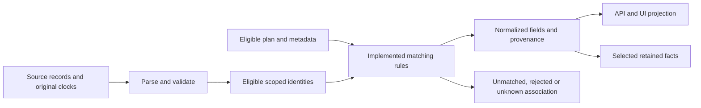

# Data associations and provenance

This reference explains how the implemented application connects source records. [Integration references](../integrations/README.md) own raw-field mappings; [the catalogue](README.md) owns entity/time definitions; [history](history.md) owns metric calculations. Rules describe the actual selectors, including first-match behavior where the code does not reject ambiguity.

## Operator namespaces and Hub prefixes

[`qualify`](../../internal/app/data.go) constructs `operator:source_id`. Equal raw IDs from different operators remain different entities. Passenger-facing names are labels, not globally unique matching keys.

`verifiedHubID` removes exactly the expected leading `[agency]` when the remainder does not begin with another bracketed prefix. `verifiedHubTrip` removes `[plan][agency]` only when the plan is the currently selected plan and the agency prefix is verified. An unmatched prefix stays literal; a parsed mismatching plan remains attached as provenance. Enrichment clears a route association when the observation's plan differs from current static data.

Synthetic examples:

| Input/context | Result |
|---|---|
| Raw `3001` for Carris and MobiCascais | `carris:3001` and `mobi:3001` remain distinct |
| `[IA9T6]118_0` with expected agency `IA9T6` | Source route `118_0` |
| `[OTHER]118_0` with expected agency `IA9T6` | Prefix preserved |
| `[P][IA9T6]T` with active plan `P` | Source trip `T`, plan provenance `P` |
| `[OLD][IA9T6]T` with active plan `P` | Trip prefix preserved; plan mismatch prevents current route enrichment |

Evidence: [mapping/enrichment](../../internal/app/ingest.go), `TestVerifiedHubPrefixes` in [app tests](../../internal/app/app_test.go).

## Active plans and GTFS relationships

[`activeHubPlan`](../../internal/app/ingest.go) requires an exact agency, `is_active`, and inclusive `active_from`/`active_until` coverage of today's Lisbon date. Among eligible records it chooses the greatest `active_from`. Equal start-date ties retain the first catalogue row; there is no ID sort or ambiguity rejection. Download time is separate from service validity.

[GTFS parsing](../../internal/app/gtfs_parser.go) joins trip to an existing route, service/calendar to trip, and stop-time to an existing trip. Local stops use coordinates within latitude 38.3–39.3 and longitude −9.7–−8.4. Trips' retained visits are sorted by sequence; route/stop membership comes from those visits, with parent-station membership where available. Active services respect weekday calendars and `calendar_dates` exceptions. Service times may exceed 24:00 and use Lisbon service-day/DST handling.

CP preserves bounded nationwide endpoint names and first/last timing context while keeping the passenger network/visits local. [Endpoint extraction](../../internal/app/gtfs_endpoints.go) identifies origin/destination by minimum/maximum sequence. Identical duplicates can remain usable; different stops at the same endpoint sequence mark that endpoint ambiguous. An unavailable endpoint does not become an invented station or estimated service.

Evidence: [schedule logic](../../internal/app/gtfs.go), [CP timing](../../internal/app/cp_schedule.go), [endpoint tests](../../internal/app/gtfs_endpoints_test.go), [ambiguity tests](../../internal/app/gtfs_endpoint_ambiguity_test.go).

## Observation stop and scheduled-service enrichment

[Stop enrichment](../../internal/app/vehicle_service.go) captures a published source stop against eligible static data when admitting the observation. It uses exact source identity within the operator, with verified prefix normalization. Later plan changes must not retroactively invent a published stop association.

Hub observations require a verified current-plan trip transformation before static stop enrichment. CM uses the current direct static catalogue. Unknown status codes become null; bounded raw source stop IDs can remain present without a matched public stop.

CP attached scheduled endpoints additionally require published `operational_date`, matching observation/static plan, exact qualified trip and route, plan-date validity and an active calendar. Inferred prediction service dates are not observed vehicle operating dates.

Evidence: [service tests](../../internal/app/vehicle_service_test.go), `TestCPObservedServiceRequiresExplicitDatePlanRoute` in [endpoint tests](../../internal/app/gtfs_endpoints_test.go), [persistence tests](../../internal/app/service_persistence_test.go).

## Geometry associations and fallback

[Shape variants](../../internal/app/gtfs_shapes.go) join trip, route, shape, plan/agency and optional direction. Coordinates are emitted as `[longitude, latitude]`, simplified from published vertices with a two-metre tolerance. The application does not create a routing-service path between stops. Train/ferry variants require usable local service visits. The non-CM GTFS parser deduplicates repeated shape sequences with identical coordinates and invalidates shapes with contradictory coordinates at the same sequence.

Non-CM [geometry fallback](../../internal/app/gtfs_geometry.go) reuses prior shapes only for the same plan, a still-existing route and a still-referenced route/shape pair. Availability/error metadata remains explicit.

CM reads four Hub plans and uses GTFS `routes.txt.line_id` to link shapes to the direct line catalogue. A successful fresh update includes only shapes for existing CM lines. Its parser validates individual shape points, then sorts and simplifies them without the non-CM duplicate-sequence conflict rejection. Its [fallback](../../internal/app/cm_shapes.go) can retain the previous CM network with an error marker, including shapes whose route IDs are absent from the current line catalogue; the shape-list API can still expose them. This is not the non-CM same-plan rule. Geometry and metadata still have bounded write admission.

Evidence: [route-shape tests](../../internal/app/route_shapes_test.go), [rail/ferry tests](../../internal/app/rail_ferry_test.go), [geometry-upgrade tests](../../internal/app/geometry_upgrade_test.go).

## Fleet metadata crosswalks and precedence

[Hub metadata](../../internal/app/metadata.go) accepts these explicit agency/code pairs: `HF16N→21`, `LA77N→41`, `BNA17→42`, `YA15B→43`, `A2L1N→44`. The vehicle ID must carry the corresponding numeric prefix. Unknown agencies and conflicting prefixes are ignored.

Synthetic examples:

| Published identity | Metadata key and association |
|---|---|
| `HF16N`, `21-3001` | MobiCascais key `3001`, matched by exact vehicle `source_id` |
| `BNA17`, `42-7` | CM key `[BNA17]7`, preserving agency identity |
| `HF16N`, `42-conflict` | Ignored; prefix contradicts the agency |

Optional GTFS `vehicles.txt` is another metadata input. MobiCascais strips the verified numeric code; CM keeps its plan agency in the key. Observations use exact `source_id` lookup. Valid direct fields take precedence over Hub fleet metadata, which takes precedence over GTFS fallback. Optional omissions, null, blank/invalid values do not erase confirmed attributes; valid zero and false remain values. Typology/propulsion remain published values, not a unified classification.

[Permanent vehicle facts](../../internal/app/vehicle_facts.go) are stored separately from expiring positions. Each field records its source reference, genuine source time when supplied, and distinct local confirmation time. Direct values record the containing report’s original source timestamp; this does not establish when the physical attribute changed. Catalogue values have no invented source timestamp. Older static/live caches seed validated fields at the lowest precedence with `legacy-cache` provenance and no invented source time; their first local recovery verification is recorded, and replay does not renew it. Metadata publication and restoration reproject these attributes onto retained positions without changing coordinates, observation/collection clocks or history evidence. An X-only response never reconfirms Y/Z. Repeated equal-clock values preserve their field clocks; changed explicit metadata can be confirmed without renewing the position. Facts have no automatic TTL and survive position expiry, static replacement, history cleanup and restart. The in-memory registry lazily reads required exact operator/source IDs; clean entries can be evicted at 8,192 cached identities, and uncommitted entries remain pending for retry. A failed initial read buffers explicitly supplied fields and replays them against the durable base before writing; a later X-only response cannot lose Y/Z received during that failure or renew their clocks. These facts are not copied into pagination revisions.

The first confirmed registration refines compatible facts for the same exact source ID without reconfirming omitted fields. A later conflicting registration creates a separate identity context and cannot inherit attributes from the previous registration. Prior contexts remain stored. Regressions cannot switch the active identity; a lower-priority catalogue cannot override a directly confirmed identity or field. Coordinates/time/provenance remain one observation, and route/trip/plan/date/pattern remain a coherent journey: missing fields in a new journey are not copied from the previous one. No proximity or speculative cross-ID matching is used. Metro synthetic train IDs are excluded from permanent physical-fleet facts. Per-field provenance is internal storage, not a new public API field. See [fact tests](../../internal/app/vehicle_facts_test.go).

These joins do not establish full inventory, permanent operator allocation, depots or Metro/Fertagus physical-unit identities. Published capacities are specifications, not occupancy.

Evidence: [specification tests](../../internal/app/provider_specs_test.go), [availability tests](../../internal/app/availability_test.go), [fleet research](../research/FLEET-FIELDS.md) (dated external evidence).

## CP prediction matching

[The CP index](../../internal/app/cp_mapping.go) requires `[active_plan][N18KL]` on the trip identifier and an existing GTFS trip. A supplied route must agree with the GTFS route, raw or `[N18KL]`-prefixed. Ordinary rows require absent or `SCHEDULED` relationships.

Stop matching uses a unique sequence when supplied; otherwise it requires a demonstrated Hub-stop-to-GTFS crosswalk and a unique occurrence of that stop in the trip. The crosswalk is rebuilt per update batch from exact sequence evidence. One Hub stop mapping to multiple GTFS stops, or multiple Hub IDs mapping to the same GTFS stop, invalidates affected associations. Duplicate visit sequences also fail uniqueness.

[Service-instance resolution](../../internal/app/cp_instance.go) validates explicit start dates against plan/calendar and optional start time against the first published departure. Without a date, it searches bounded candidate service days and requires a unique coherent instance based on chronology, calendars and available event times/delays. Frequencies or insufficient/contradictory timing can prevent planned association. A trip ID's date-like suffix is not treated as today's operating date.

An independently valid absolute ETA can still be exposed with unknown service date. Delay-only ETA needs resolved planned time; null delay is not zero. When an instance is matched, absolute ETA and signed delay must agree with planned time. Fresh publication and original trip-update timestamps are checked separately. Upcoming predictions are bounded to two hours. A newer candidate supersedes an older one; conflicting candidates at the same timestamp are excluded. Applicable later cancellation/skipped updates suppress predictions.

Synthetic cases: a unique sequence demonstrates `hub-S→S` and can support another update in that batch; contradictory mappings to `S` and `T` are rejected. An absolute event may survive absent date, while the same record containing only delay cannot manufacture planned time.

The [frontend CP helpers](../../frontend/src/cp.ts) apply separate display joins. A prediction replaces a planned station arrival only when both have scheduled times and exactly matching plan, operator, source trip, service date, stop, stop sequence and scheduled instant. The prediction must have a known service date. [Station arrival rendering](../../frontend/src/CPPredictions.tsx) keeps other upcoming planned arrivals alongside current predictions. Vehicle prediction lists require a CP vehicle with published `plan_id`, `trip_id` and `operational_date`, then match prediction plan/source trip/service date exactly; they do not substitute an inferred date for the vehicle's operating date.

Evidence: [normalization](../../internal/app/cp_predictions.go), [prediction tests](../../internal/app/cp_predictions_test.go), [read/plan-race tests](../../internal/app/cp_reads_test.go), [sanitized fixtures](../../internal/app/testdata/cp/README.md).

## Requested-stop arrival matching

The five additional TML operators use exact active plan/agency/trip identity and a unique published visit sequence. A batch builds both directions of the source-stop/GTFS-stop crosswalk, including unrequested visits that reveal conflicts. Contradictory mappings, cancelled trips, duplicate sequence identities and equal-clock conflicting predictions exclude affected associations. Parent-station requests collect validated child visits without replacing their identities. The latest original update wins for a visit; admission does not depend on GPS.

Explicit service dates require plan/calendar validity, compatible absolute events and the correct optional start time. Without a date, a unique active day must satisfy published absolute-time/delay equations. Absolute time remains authoritative when delay contradicts it, but only within a uniquely compatible nonoverlapping daily instance; unknown date leaves schedule/date/vehicle fields absent. Frequency descriptors lacking sufficient instance context are rejected. GTFS timing extrema include national visits, remain compact in the static cache, and respect Lisbon DST and clocks beyond24:00.

A prediction replaces a planned visit only when plan, normalized source trip, service date and visit sequence are proven equal. Unmatched planned rows remain separate. A vehicle link additionally requires exact normalized physical identity, operator, plan, trip, published operating date, one usable fresh observation and current context. The API and UI revalidate the link as live context changes without discarding the ETA. CM direct arrivals do not establish such a link.

Synthetic example: `[P][IA9T6]T` with sequence2 can prove source stop `H` corresponds to GTFS visit `S`. If another current record maps `H` to a different stop, affected ETAs cannot replace scheduled visits. A future absolute ETA with inconsistent delay can still be shown without an inferred service date.

Implementation: [visits](../../internal/app/arrivals_tml_visits.go), [date proof](../../internal/app/arrivals_tml_day.go), [snapshot selection](../../internal/app/arrivals_tml_snapshot.go), [merge](../../internal/app/arrivals_merge.go), [vehicle proof](../../internal/app/arrivals_vehicle.go). Evidence: [HTTP/date/identity tests](../../internal/app/arrivals_test.go).

## Metro station and line matching

[`metroStationID`](../../internal/app/metro.go) first accepts an exact source station code. Otherwise it finds the requested GTFS stop and returns the first published station whose normalized name is a prefix of the GTFS normalized name and whose absolute latitude and longitude differences are each less than 0.005 degrees. Normalization ignores accents/case. This is a coordinate tolerance, not a metric-distance threshold or a uniqueness check. Candidate ordering can affect the fallback.

Line identity comes from a recognized destination terminal code or a station listing exactly one line. GTFS route abbreviations `Az`, `Am`, `Vd`, `Vm` map to line identities; unknown line stays unknown. Predicted arrival time is published `hora` plus decoded wait seconds bounded to 0–7,200. The current integer decoder accepts explicit JSON null as zero, while omitted/malformed waits and numeric strings are rejected. A fresh original source time and nonempty train reference are required; an empty or unknown destination can still produce a prediction with a published-code fallback label. Predictions do not establish GPS or confirm a physical arrival.

Evidence: [Metro implementation](../../internal/app/metro.go), Metro cases in [app tests](../../internal/app/app_test.go).

## Continuity and last-known state

[Continuity admission](../../internal/app/continuity_publication.go) rejects regressing timestamps. Repeated timestamps retain the original coordinates, journey context, provenance and collection time, without a new history sample. Independently supplied stable metadata may update at the same position clock. Missing membership, unverified source, restart or bounded-ledger eviction breaks continuity. A later report can be admitted while its speed/distance remains null until an eligible consecutive pair exists.

The display projects current reports only when the source was verified within 90 seconds and observation age is at most 180 seconds. Omitted/stale/unverified reports remain eligible for display only until ten minutes after their original source clock, for every operator. New publications do not cap the retained display at 500; page limits still apply, and clients retrieve every page using its frozen revision. The continuity ledger is separately capped at 2,000 identities and preserves a replay floor. Last-known rows use original observation clocks, have null speed and do not prove stationary/inactive/out-of-service status. At five minutes a small amber warning is added beside the marker icon, with the vehicle update age available in the popup and warning text grouped in its footer. This threshold is uniform across operators, including CP. It does not change coordinates, source identity, current metric eligibility or establish physical inactivity. `inactive_at` remains a legacy five-minute timestamp and does not control the UI. At the ten-minute deadline markers and station vehicle links leave the current display, while an open detail remains with “Sinal expirado”. Client aging runs locally every second; repeated source timestamps, polling, pinned pages and restart do not renew the deadline.

Restoration marks persisted positions unverified, breaks continuity and advances a replay floor; it does not create new movement history. See [history calculations](history.md#sampled-speed-and-distance) for the additional position/time/plausibility conditions.

## Provenance flow

This is a conceptual flow, not one universal pipeline. CP predictions and direct Metro waits do not enter retained vehicle history. Source URL, source/plan identities and original clocks remain explicit where the API representation supports them. Unknown associations stay unavailable rather than being guessed.

## Frozen navigation and CM pattern selection

[Vehicle navigation](../../internal/app/vehicle_navigation.go) issues cache-bound references only for validated original observations. Scheduled arrival and CP prediction links require a unique exact published operator/plan/source-trip/operating-date association; station membership alone supports a separate vehicle list, not an inferred service match. Stop navigation additionally checks the returned catalogue revision, source identity, name, coordinates and optional plan against the frozen call's provenance.

[CM pattern parsing](../../internal/app/cm_patterns.go) preserves the explicit original `[plan][agency]pattern` namespace from vehicle `pattern_id`. GTFS `routes.txt.line_id` must match the vehicle line, and all trips in that pattern must have the same shape, direction and ordered stop visits. Two streaming passes verify all trips independently of row order, rejecting duplicate, missing, extra, unknown or inconsistent visits. Loop visits remain distinct. The complete path additionally requires every stop in the native catalogue and the shape in the same static revision. Never extract pattern/date from a trip ID or substitute another plan/variant. Old CM caches without an index or a recorded path/geometry attempt are eligible for the normal scheduled static refresh before the six-hour reuse TTL. A completed attempt without any verified path records explicit unavailability, including across cache restore, so it does not repeatedly bypass the TTL. Until refresh succeeds, the next-stop fallback remains.

## Complete journey and stop-event association

[Journey popups](../VEHICLE-POPUPS.md) require a unique operator-scoped trip, matching route and plan, an explicit operating date, an active calendar and a strictly ordered visit sequence. Frequency-based schedules without an identified instance fail closed. Metro Hub's approximate trip assignment never establishes a vehicle journey. Stop progress requires a fresh published stop/status and a single matching visit; repeated visits without a sequence leave progress unknown.

Metro's separate published-route association uses the current exact plan/route and a unique approximate trip only as a direction/path hint. A conflicting fresh direct train destination rejects that hint. With no trip reference, the fresh direct destination must select matching route candidates with identical stop IDs and visit sequences; differing variants remain unresolved. Ordered visits and a known orientation/destination are required. No service date, calendar instance, timetable or actual/predicted stop time is inferred. Route-only progress is at most estimated, and repeated stops or stale observations do not establish it. See [the published-route behavior](../VEHICLE-POPUPS.md#cached-reads-and-identity).

Navigable timed-journey and Metro route-only stop rows expose the supplying static plan identity when present and its update clock. The browser forwards both to the existing current-catalog revalidation; neither frozen route data nor a matching stop name alone permits navigation after a plan replacement.

CM full schedules namespace trips and services with the explicit archive plan/agency and map `routes.txt.line_id` to the native line. A CM operating date is copied only from the already collected Hub record with the exact qualified vehicle, qualified trip and original observation instant. The plan prefix is an explicit namespace; operating date is never inferred from a trip ID. Native forecasts without a dated visit remain independent station calls. Metro short variants share orientation only when their entire normalized parent-stop sequence occurs in order in the longer representative; default direction and actual journey destination remain distinct.

Actual arrival/departure records additionally require an explicit occurrence, source URL, source and collection clocks and exact journey/visit/kind. A correction needs a greater provider revision and explicit correction flag. Contradictory records suppress the selected time. GPS, ETA and stop status are insufficient evidence, and no current occurrence adapter is enabled.

## Reporting identity and omission

Latest reporting state uses the exact operator/source key separately from physical-fleet registration contexts. No proximity, route or cross-ID match merges reporting identities. This includes Metro inferred entity IDs without asserting physical-unit identity. Successful accepted normalized membership, rather than raw provider array presence, drives omission; source filters and rejected observations can remove rows. Durable original observation clocks reject older reports even after the position continuity ledger expires. Repeated accepted reports refresh membership collection time without renewing the original observation time. Source errors/restart/expired collection are unconfirmed states. See the [state evaluation and clock definitions](README.md#backend-owned-reporting-state).
